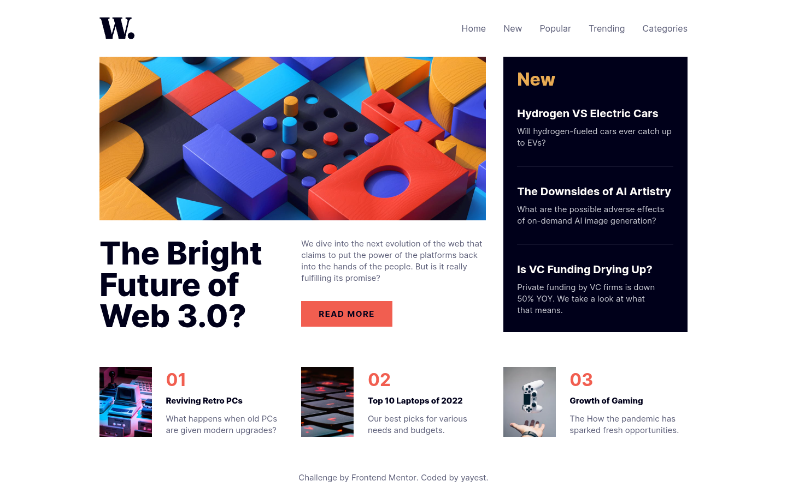

# Frontend Mentor - News homepage solution

This is a solution to the [News homepage challenge on Frontend Mentor](https://www.frontendmentor.io/challenges/news-homepage-H6SWTa1MFl). Frontend Mentor challenges help you improve your coding skills by building realistic projects. 

## Table of contents

- [Frontend Mentor - News homepage solution](#frontend-mentor---news-homepage-solution)
  - [Table of contents](#table-of-contents)
  - [Overview](#overview)
    - [The challenge](#the-challenge)
    - [Screenshot](#screenshot)
    - [Links](#links)
  - [My process](#my-process)
    - [Built with](#built-with)
    - [What I learned](#what-i-learned)
  - [Author](#author)

## Overview

### The challenge

Users should be able to:

- View the optimal layout for the interface depending on their device's screen size
- See hover and focus states for all interactive elements on the page

### Screenshot



### Links

- Solution URL: [news-homepage-main](https://github.com/yayest/news-homepage-main)
- Live Site URL: [news-homepage-main](https://yayest.github.io/news-homepage-main/)

## My process

### Built with

- Semantic HTML5 markup
- CSS custom properties
- Flexbox
- CSS Grid
- Mobile-first workflow

### What I learned

I managed to make a mobile menu without using js, I used popover, I like what happened.

```html
<dialog class="menu-dialog" id="menu" popover>
  <button class="menu-button-hide" type="button" popovertarget="menu" popovertargetaction="hide"
    aria-label="Hide menu"></button>
  <nav>
    <ul>
      <li><a href="#Home">Home</a></li>
      <li><a href="#New">New</a></li>
      <li><a href="#Popular">Popular</a></li>
      <li><a href="#Trending">Trending</a></li>
      <li><a href="#Categories">Categories</a></li>
    </ul>
  </nav>
</dialog>

<button class="menu-button-show" type="button" popovertarget="menu" aria-label="Show menu"></button>
```

## Author

- Website - [GitHub](https://github.com/yayest)
